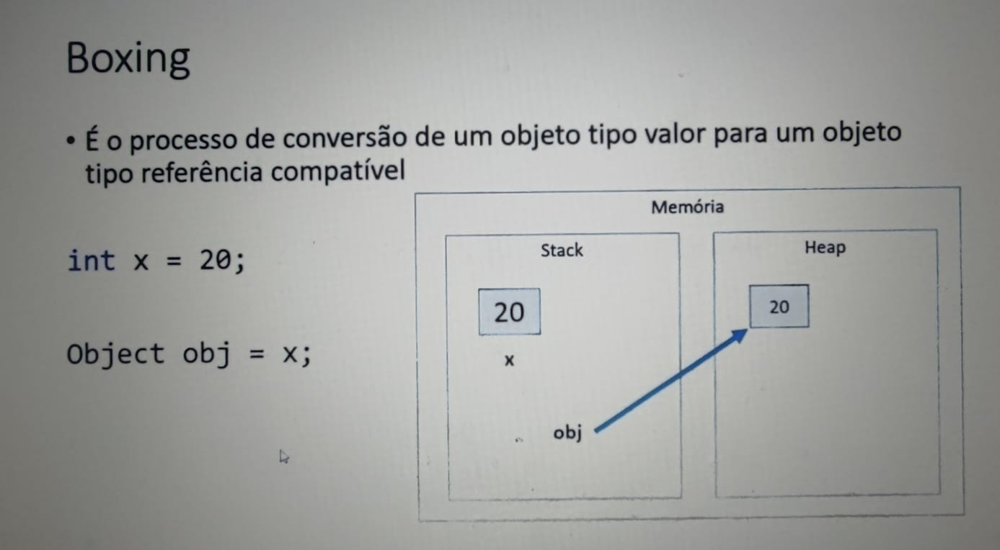
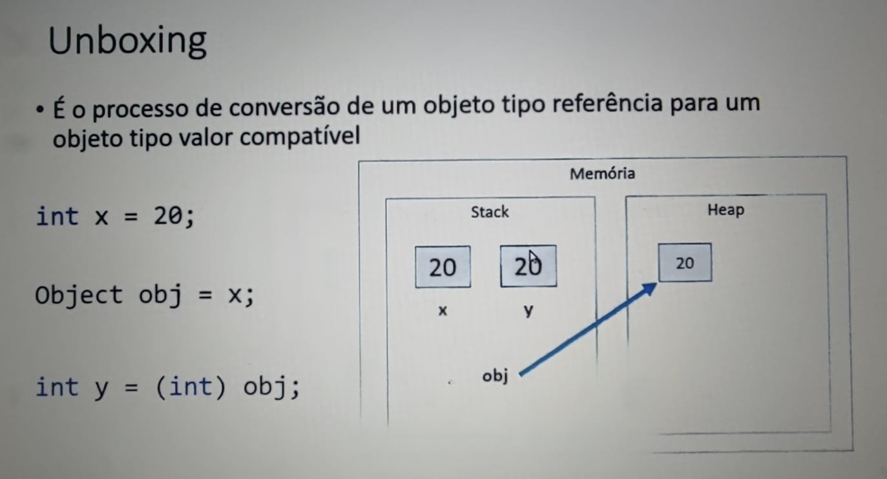
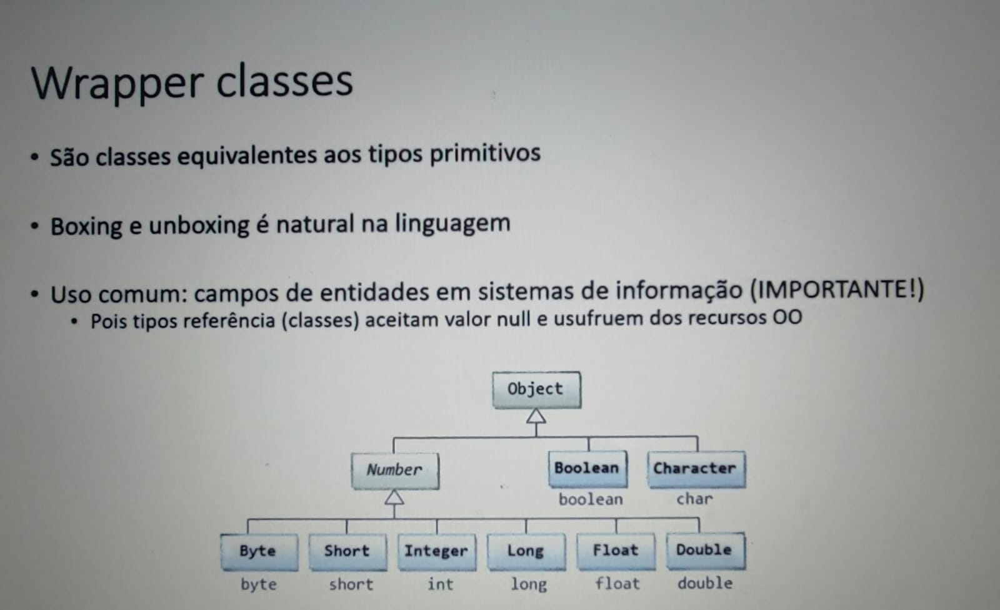

# Boxing, Unboxing e Wrapper Class

Este diretório contém exemplos e explicações sobre os conceitos de **Boxing**, **Unboxing** e **Wrapper Classes** em Java.

## Conceitos

- **Boxing**: Processo de conversão de um tipo primitivo para o seu equivalente em classe wrapper.
- **Unboxing**: Processo inverso, onde um objeto wrapper é convertido de volta para o tipo primitivo.
- **Wrapper Classes**: Classes que encapsulam tipos primitivos em objetos, permitindo que sejam tratados como referências.

## Exemplos

Os exemplos neste diretório abordam:

1. Como realizar boxing e unboxing.
2. Uso de classes wrapper como `Integer`, `Double`, `Boolean`, entre outras.
3. Vantagens e desvantagens do uso de wrapper classes.

