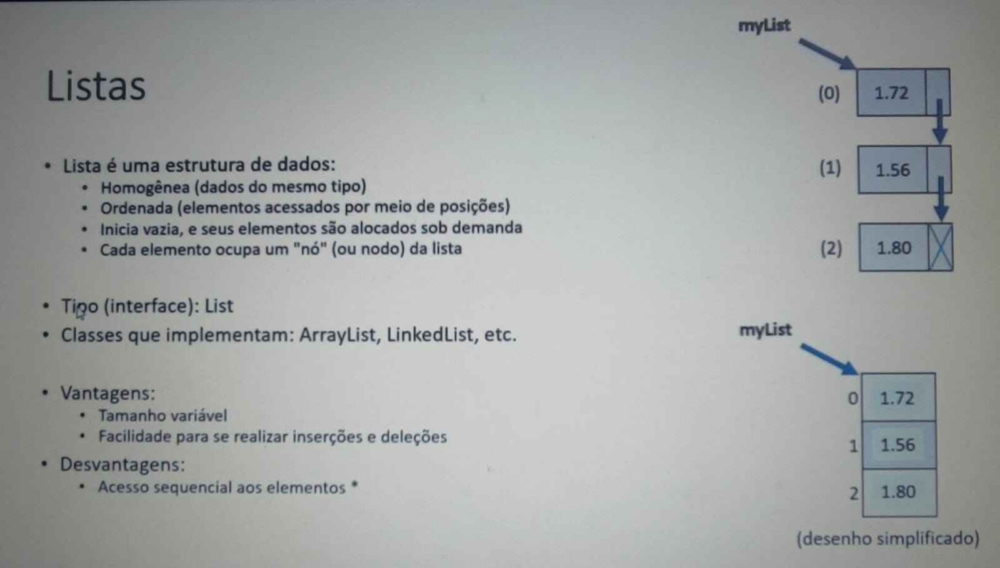
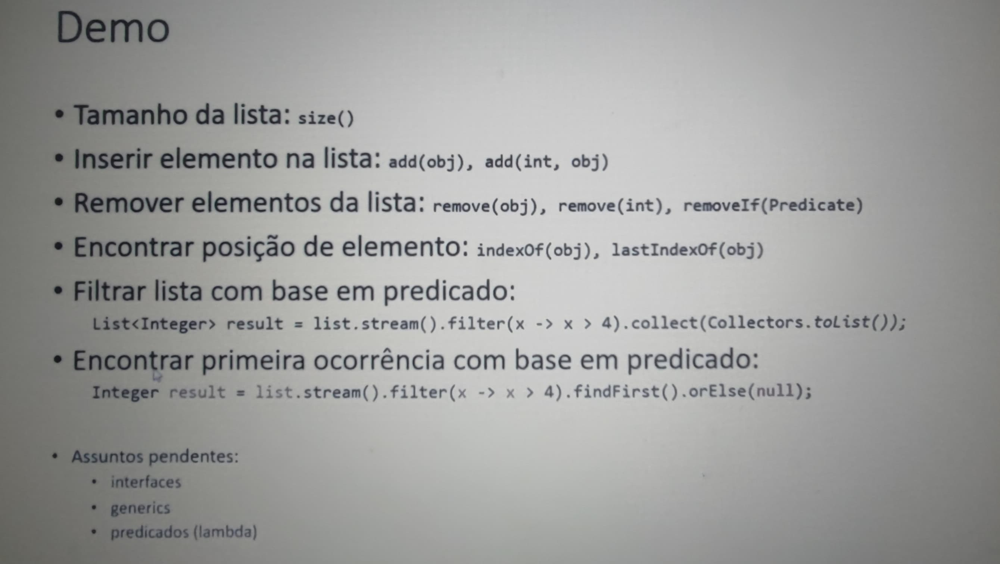

# Comportamento de Memória, Arrays e Listas - Listas

Este diretório contém exemplos e explicações sobre o comportamento de memória relacionado a listas em Java. Aqui você encontrará conceitos importantes e exemplos práticos para entender como listas funcionam e como manipulá-las de forma eficiente.

## Imagem Ilustrativa

Certifique-se de explorar os exemplos e adaptar os conceitos às suas necessidades.

## Tópicos Abordados

- Introdução às Listas em Java
- Diferenças entre Arrays e Listas
- Operações comuns com Listas
- Boas práticas no uso de Listas

## Imagem Adicional

A imagem acima ilustra um exemplo prático de como as listas podem ser utilizadas em Java para armazenar e manipular dados de forma dinâmica. Observe como as operações de adição, remoção e iteração são representadas visualmente, facilitando a compreensão do funcionamento interno das listas.