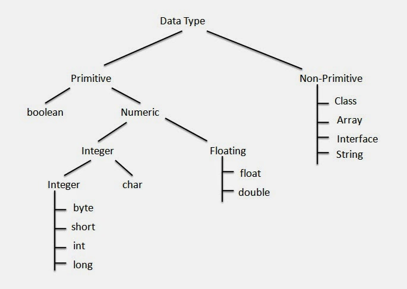

## Tipos de Dados em Java

Java possui dois grupos principais de tipos de dados:

### 1. Tipos Primitivos
- **byte**: 8 bits, valores de -128 a 127
- **short**: 16 bits, valores de -32.768 a 32.767
- **int**: 32 bits, valores de -2³¹ a 2³¹-1
- **long**: 64 bits, valores de -2⁶³ a 2⁶³-1
- **float**: 32 bits, ponto flutuante de precisão simples
- **double**: 64 bits, ponto flutuante de precisão dupla
- **char**: 16 bits, representa um caractere Unicode
- **boolean**: valores `true` ou `false`

### 2. Tipos Referência
- **Strings**
- **Arrays**
- **Objetos** (instâncias de classes)

> Os tipos primitivos armazenam valores simples, enquanto os tipos de referência armazenam endereços de memória para objetos.

### Exemplo de declaração
```java
int idade = 25;
double altura = 1.75;
char letras = 'J';
boolean ativo = true;
String nome = "João";
```

